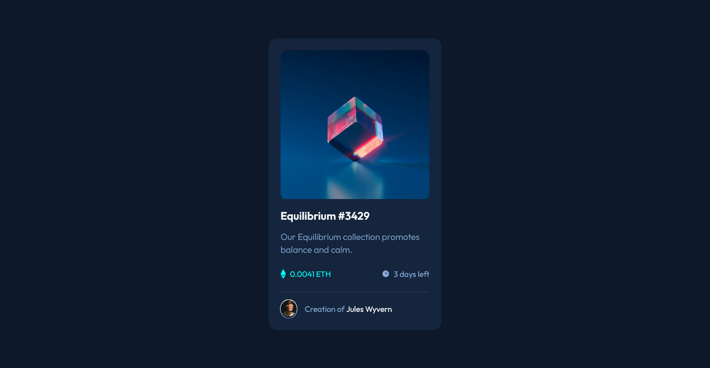
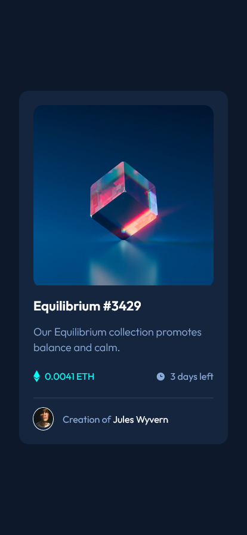

# Frontend Mentor - NFT preview card component solution

This is a solution to the [NFT preview card component challenge on Frontend Mentor](https://www.frontendmentor.io/challenges/nft-preview-card-component-SbdUL_w0U). Frontend Mentor challenges help you improve your coding skills by building realistic projects.

## Table of contents

- [Overview](#overview)
  - [The challenge](#the-challenge)
  - [Screenshot](#screenshot)
  - [Links](#links)
- [My process](#my-process)
  - [Built with](#built-with)
  - [What I learned](#what-i-learned)
  - [Continued development](#continued-development)
  - [Useful resources](#useful-resources)
- [Author](#author)
- [Acknowledgments](#acknowledgments)

**Note: Delete this note and update the table of contents based on what sections you keep.**

## Overview

### The challenge

Users should be able to:

- View the optimal layout depending on their device's screen size
- See hover states for interactive elements

### Screenshot

### Links

- Repository: [Github Repo](https://github.com/Clytax/nftcard)
- Live Site URL: [Vercel](https://nftcard-three.vercel.app/)

## My process

### Built with

- Semantic HTML5 markup
- CSS custom properties
- BEM Naming
- Flexbox
- CSS Grid
- Mobile-first workflow
- [React](https://reactjs.org/) - JS library

### What I learned

I didn't learn too much, but it was a good way to practice my skills :)

### Continued development

In the future I want to focus more on accessibility. Also, I need to practice the mobile-first workflow ^^

## Author

- Frontend Mentor - [@Clytax](https://www.frontendmentor.io/profile/clytax)
- Twitter - [@EinfachCoden](https://www.twitter.com/EinfachCoden)
